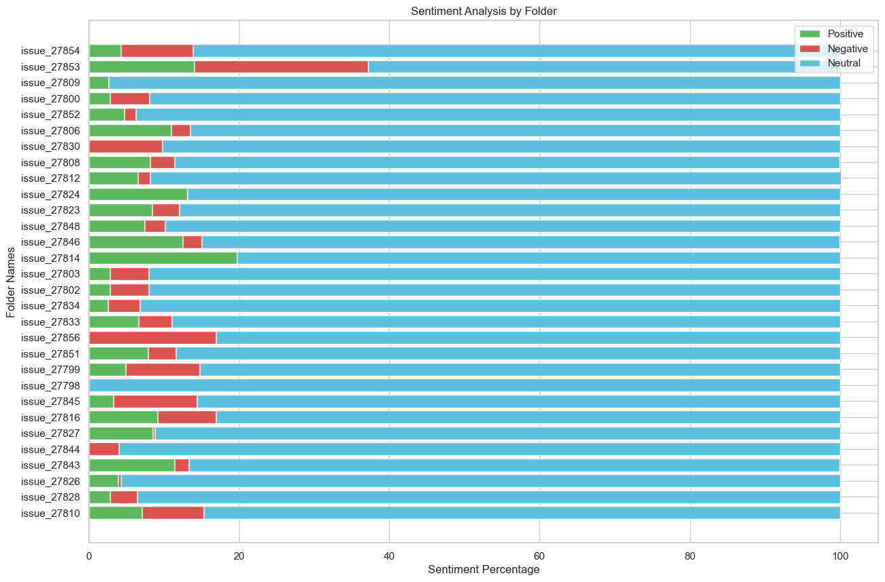

# Stackup Github issue sentiment analyzer

## Introduction

Analyze sentiment of the latest 30 github issues from a specific github repo.

This repository is part of a challenge from [Stackup Campus](https://community.campus.dev/web?sid=space_16a69442-cb83-4027-85b0-ca5f1d7e650b&target_path=%2Flearners%2Fcampaigns%2Fai-slash-ml-with-python-web-scraping-and-sentiment-analysis)

## Get data

Run the notebook `download_github_data.ipynb`, it will download the issues in the output folder.
You can use an API KEY if you don't want to be rate limited but it is optional.

Data from the repository react is already in the output folder here.

## Check sentiment's issues

Run the notebook `sentiment_analysis_github.ipynb`

Here is an output example
